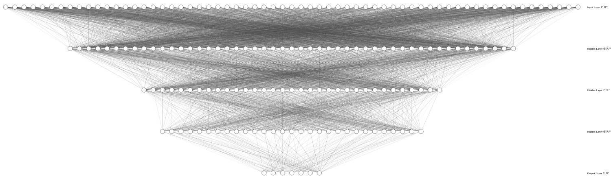
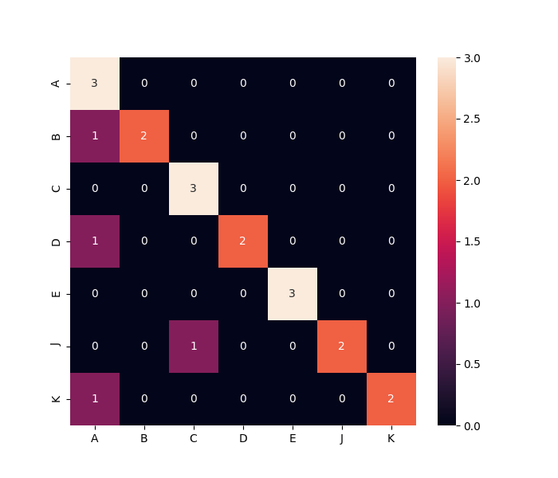

# **Beronivalda, a reconhecedora de caracteres**
## **Multilayer Perceptron**

### Implementação da rede neural artificial Multilayer Perceptron com uma camada escondida e treinada com o algoritmo Backpropagation de gradiente descendente.

O EP foi desenvolvindo no sistema operacional Ubuntu 18.04.5 LTS utilizando o pyenv como 
plugin para gerenciar virtualenvs do Python. Para baixar o pyenv, acesse o [link](https://github.com/pyenv/pyenv-virtualenv) da página oficial no GitHub. Não é obrigatório mas irá evitar possíveis conflitos de dependências :). Versão python utilizada: 3.8.0  
Para criar o ambiente virtual:
```
make environment
```
Para instalar as bibliotecas utilizadas no EP:
```
make requirements
```

### **Executando o MLP**
```
make start
```
#### **Arquitetura da rede**


#### **Matriz de confusão**  
  

**Estrutura de arquivo do MLP:**
```
├── _requirements.txt -> dependências do EP
├── _datasets/ --> contém todos os datasets utilizados no EP
├── _load_data.py --> carrega os datasets
├── _funcao_step.py --> contém todas funções de ativação que foram testadas no MLP
├── _mlp.py --> implementação do Multilayer Perceptron
├── _arquitetura-MLP.svg
├── _matriz_de_confusao.png
└── _main.py --> script para a execução do MLP e análise dos resultados
```  
Integrantes do grupo:
* Alexandre Kenji Okamoto
   * 11208371 | alexandre.kenji19@usp.br
* Fernanda Cavalcante Nascimento 
   * 11390827 | nandacnas@usp.br
* Guilherme Mutschele Sena
   * 11208304 | guilhermem.sena@usp.br
* Michelly Rodrigues da Silva
   * 11270607 | michelly.rds@usp.br
* Raul Sperandio
   * 11271060 | raulsperandio@usp.br 

